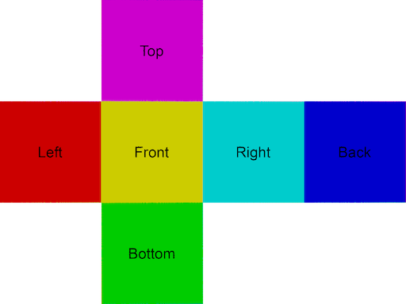

This project consists of a simple program to demonstrate how to render a 3D skybox from 2D horizontal cross cubemap. 



The dimensions of the 2D image must be in the ratio 4:3.

Instantiation of a 2D OpenGL texture from High Dynamic Radiance (hdr) files is supported. The graphics engine is Apple's OpenGL implementation for the macOS or its OpenGLES implementation for the iOS.

Testing is done only for modern OpenGL 3.2 and OpenGLES 3.0.
<br />
<br />
<br />

**Horizontal Cross Cubemap** 

For macOS programmers, creating cubemaps from six 2D textures is straightforward using Apple's GLKit framework. There are two GLKTextureLoader class methods

```swift
    cubeMap(withContentsOfFile:, options:)
```
and 

```swift
    cubeMap(withContentsOf:, options:)
```

which when called will instantiate an OpenGL cubemap texture and return an instance of GLKTextureInfo containing information about the newly created texture. The "name" property is texture name that is used for binding with the call:

```c
    glBindTexture(GLenum target, GLuint texture);
```

where target is GL_TEXTURE_CUBE_MAP whenever the skybox needs to be drawn as part of the update process. (The class GLKTextureLoader was available for iOS 5.0 and macOS 10.8).

This demo will be using the GLKTextureLoader call:

```swift
    texture(withContentsOf: options:)
```

to load a 2D image file with a resolution of 2048:1536 (ratio 4:3) for images of file type png or a custom C call

```c
    textureFromRadianceFile(const char *pathName, int *width, int *height)
```

to load high dynamic range images and create a 2D texture.

Once the 2D texture (of type GL_TEXTURE_2D) is instantiated and program setup is complete, the draw() method is called to render the 3D skybox.

To allow the user to see the skybox, a simple camera (based on raytracing) is implemented within the fragment shader.

Basically, the vertex shader produces a large triangle which is clipped output a quad.

The fragment shader receives some uniforms from the CPU side to help in the setup of a simple camera. All the user needs to do is drag the mouse (use a one-finger touch for iOS devices) to look around the insider of the skybox.

In order to access a cubemap texture, a 3D direction must be generated from the mouse drags. The direction is converted into a faceIndex and a pair of uv coodinates by calling the function

```glsl
    dirToCubeUV(vec3 dir, out int faceIndex)
```

All that remains to be done is to map the returned uv to a pixel on the 4:3 texture passed as a uniform to the fragment shader.

<br />
<br />
<br />

**Requirements:** XCode 9.x, Swift 4.x and macOS 10.13.4 or later.
<br />
<br />

**References:**

https://en.wikipedia.org/wiki/Cube_mapping

https://www.shadertoy.com/view/tlyXzG


